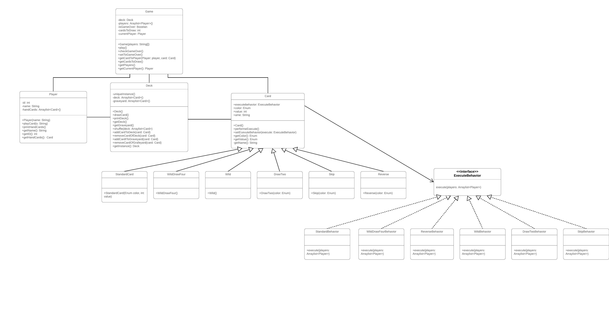

# Assignment 5
## Part 1 - SnakeAndLadder
Our test cases cover the entire functional area of our game.
All test cases were successful.
Therefore we didn't find any bug in our snakeandladder-game.
We only added some functions like getLastDice() and getPlayers() in the game class to help with testing.

We didn't indicate the tags @param and @return when using javadocs because our test methods have no parameters that the method accepts
and they also don't return anything.

## Part 2 - TicTacToe
### GameboardTest
As we first ran the GameBoardTest file four tests failed (“markOnBoard()”, “markTwice()”, “getOpenPositions” and “getOpenPositionsAll”).
* “markOnBoard” and “markTwice”:  
    The method “mark” returned true if the position was already marked and false if it was empty. But the correct solution is exactly the other way around. To solve the problem, we changed both return statements with each other.
* “getOpenPositions” and “getOpenPositionsAll”:  
    To get these to tests passed, we had to make a change on the “getOpenPostions” method. Since the second for loop started with 1 instead of 0 the first column was never considered. To resolve this, we changed the initial value of the integer “col” to 0.
### TicTacToeGameStateTest
After all tests of the GameBoardTest were working, we ran the TicTacToeGameStateTest and seven tests failed (“hasWinColl”, “hasWinRow”, “isOverWin”, “hasWinDiagonal”, “startingPlayerIsX”, “getAvailableStatesLastOne” and “switchPlayer”).
* “hasWinColl”, “hasWinRow” and “isOverWin”:  
    The method “hasWin” returned false if the player completed a row or a column. That violates the rules of tictactoe, because completing a row or a column is the goal of the game. We just needed to rewrite the return statement to true.
* “hasWinDiagonal”:  
    The method “completesDiagonal” had an error in the last return statement. Instead of returning true if one of two possible diagonals was completed, it method return true if you achieved a diagonal looking like a front slash or a formation like a equal to or greater symbol. The second comparison in the first part of the return statement had to be changed (TicTacToeGameState, line 158). Therefore, the row attribute passed to the getMark method changed from 0 to 2.
* “startingPlayerIsX”, “getAvailableStatesLastOne” and “switchPlayer”:  
    To pass these tests, we had to make changes in the method “getCurrentPlayer”, because all three tests use this method. Instead of returning the current player, a new player, called randomPlayer, was created and returned. To fix the problem, we deleted the randomPlayer.

## Part 3 - UNO

##### expected input
First of all the user has insert the player's names.
Afterwards each player inserts which card he wanna use.
Every card has an identifier.
The system only allows these identifiers as input.
* Standard cards:  
    The identifier consists of a letter which stands for the color, a number which stands for the specific figure of the card.
For example B3 stands for the blue card with the number three.
* Wild Draw 4:  
    The identifier consists of an equal sign followed by the first letter of the card's color and +4 which means the next player has to take four more cards.
For example =B+4 stands for a Wild Draw 4 card where the player desired to change the color to blue.
* Wild:  
    The identifier consists of an equal sign followed by the first letter of the specific color which the player desires.
For example =R stands for a Wild card where the player desired to change the color to red.
* Draw Two:  
    The identifier consists of the first letter of specific color of the card followed by +2 which means the next player has to take two more cards.
For example G+2 stands for the yellow Draw Two card.
* Reverse:  
    Insert -1 to reverse order of the game.

##### Behavior of the system
Once the player did a valid input the system takes the card from the player's hand and places it on the graveyard.
If the played card is a special card for example like Draw Two the system automatically puts two additional cards on the next player's hand
(on the condition that this player hasn't played a second Draw Two card).
We used different design patterns for the behavior of the system. For instance we use a singleton for the deck class, since there only one deck is allowed and 
the deck is accessible from everywhere. Also we used the command pattern to program the behavior of the cards.

##### expected output
The system informs if the input is valid, whats happening when the card is played and which the last played card is.
It should also notify if a player has no cards anymore which means he has won.

##### Class Diagram
